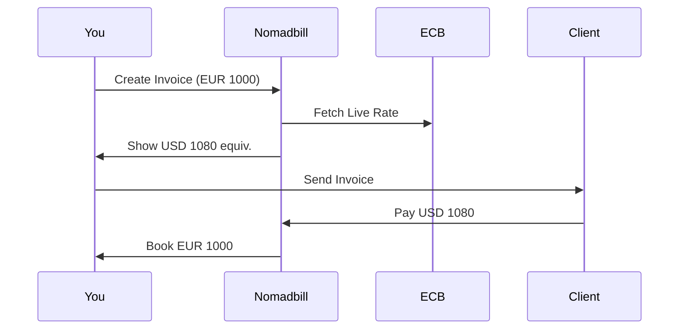

## Overview

Nomadbill equips you with essential tools for global business operations. You handle invoices across multiple currencies, automate bookkeeping tasks, set up recurring billing, gain insights from your dashboard, and generate invoices in various languages. These features streamline your workflow, letting you focus on growth.

<Columns cols={3}>
  <Card title="Multi-Currency Invoicing" icon="globe" href="#multi-currency">
    Invoice clients in 44 currencies with live exchange rates locked at send time.
  </Card>
  <Card title="Autopilot Bookkeeping" icon="zap" href="#autopilot">
    Automatically recognize, reconcile, and categorize every transaction.
  </Card>
  <Card title="Recurring Billing" icon="repeat" href="#recurring">
    Set up automated billing cycles that send, remind, and reconcile payments.
  </Card>
</Columns>

<Columns cols={2}>
  <Card title="Dashboard Analytics" icon="bar-chart-3" href="#dashboard" horizontal>
    View revenue, expenses, and profits at a glance with customizable widgets.
  </Card>
  <Card title="Multi-Language Invoices" icon="translate" href="#multi-language" horizontal>
    Generate professional invoices in your clients' preferred languages.
  </Card>
</Columns>

<Callout kind="info">
  All features integrate seamlessly with your Nomadbill dashboard at https://app.nomadbill.co.
</Callout>

## Multi-Currency Invoicing

Create invoices in any of 44 supported currencies. Nomadbill uses live ECB rates and locks the FX rate when you send the invoice. Your client pays in their currency, and your books reflect your base currency automatically.

<Steps>
  <Step title="Select Currency" icon="globe">
    Choose from the currency dropdown in the invoice editor.
  </Step>
  <Step title="Enter Amount" icon="dollar-sign">
    Input the amount. Nomadbill shows the converted value in real-time.
  </Step>
  <Step title="Send Invoice" icon="send">
    Lock the rate and dispatch. Track payments via email notifications.
  </Step>
</Steps>



## Autopilot Bookkeeping

Nomadbill recognizes inflows and outflows automatically. Connect your bank accounts, and it reconciles transactions against invoices without manual entry. Update statuses for outstanding items instantly.

<Tabs>
  <Tab title="Bank Sync" icon="banknote">
    Link accounts via Plaid or manual CSV upload.

````bash
# Example CSV format for upload
date,amount,currency,description
2024-10-15,48962,EUR,"Invoice NB-0142 paid"
````
  </Tab>
  <Tab title="Reconciliation" icon="check-circle">
    View matched transactions in the dashboard.

    <Image
      src="https://nomadbill.co/assets/reconciliation.png"
      alt="Autopilot reconciliation screen"
      width="800"
      height="400"
    />
  </Tab>
</Tabs>

## Recurring Billing

Set up subscriptions once. Nomadbill handles sending, reminders, retries, and reconciliation—even when you are offline.

<CodeGroup tabs="API,cURL">
```javascript
// Create recurring invoice via API
const response = await fetch('https://api.nomadbill.co/v1/invoices/recurring', {
  method: 'POST',
  headers: { 'Authorization': 'Bearer YOUR_API_KEY' },
  body: JSON.stringify({
    client_id: 'cli_123',
    amount: 3200,
    currency: 'EUR',
    frequency: 'monthly',
    next_date: '2024-11-01'
  })
});
```
```bash
curl -X POST https://api.nomadbill.co/v1/invoices/recurring \
  -H "Authorization: Bearer YOUR_API_KEY" \
  -H "Content-Type: application/json" \
  -d '{
    "client_id": "cli_123",
    "amount": 3200,
    "currency": "EUR",
    "frequency": "monthly"
  }'
```
</CodeGroup>

<ParamField path="client_id" param-type="string" required="true">
  Unique client identifier.
</ParamField>

<ParamField path="frequency" param-type="string" required="false">
  Options: `monthly`, `quarterly`, `yearly`. Defaults to `monthly`.
</ParamField>

## Dashboard Analytics

Your dashboard provides real-time insights into revenue, expenses, profits, and cash flow. Customize widgets to track key metrics like outstanding invoices or top clients.

<Board title="Business Overview">
  <BoardColumn title="Revenue" color="2" icon="trending-up">
    <BoardCard title="Q4 Invoices" description="€45,200 total" icon="dollar-sign" />
    <BoardCard title="Pending" description="3 invoices" icon="clock" dueDate="2024-12-31" />
  </BoardColumn>
  <BoardColumn title="Expenses" color="1" icon="trending-down">
    <BoardCard title="Travel" description="$1,200" icon="plane" />
    <BoardCard title="SaaS" description="$450" icon="package" />
  </BoardColumn>
  <BoardColumn title="Profits" color="3" icon="activity">
    <BoardCard title="Net Profit" description="€12,500" icon="check-circle" />
  </BoardColumn>
</Board>

## Multi-Language Invoices

Support global clients by generating invoices in languages like English, Spanish, French, and more. Set client preferences, and Nomadbill translates labels automatically.

<Expandable title="Supported Languages" default-open="true">
  - English (default)
  - Español
  - Français
  - Deutsch
  - Italiano
  - Português

  Customize via client profile settings.
</Expandable>

<Callout kind="tip">
  Enable multi-language in account settings for automatic detection based on client location.
</Callout>

<Card title="Next Steps" icon="book-open" href="/quickstart">
  Set up your first multi-currency invoice today.
</Card>