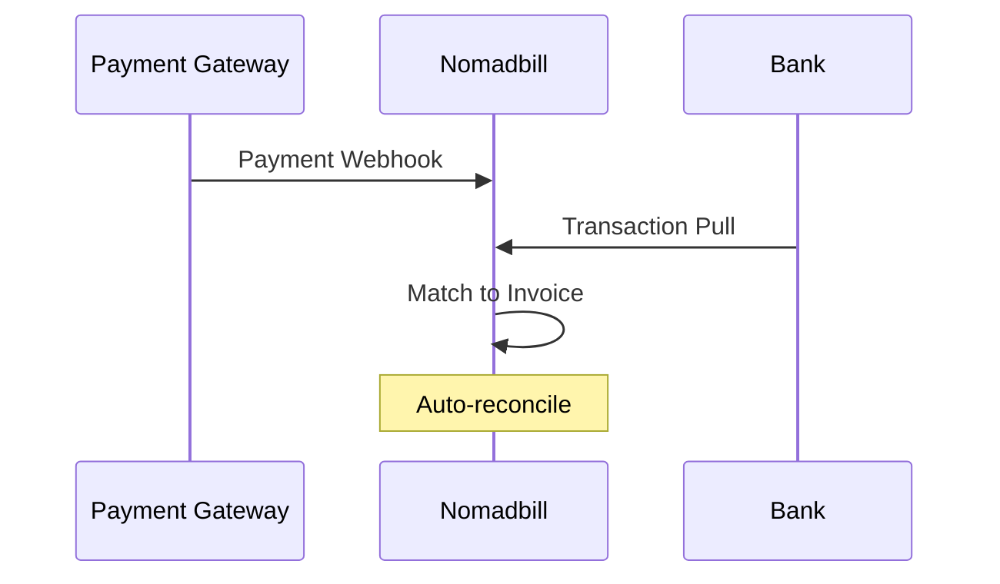

## Overview

Nomadbill integrates with popular payment gateways, banks, and tools to automate your invoicing and bookkeeping. Sync payments from Stripe, connect bank accounts like Wise or Mercury, and use webhooks for custom workflows. Once connected, transactions reconcile automatically, saving you hours on manual entry.

<Columns cols={3}>
  <Card title="Payment Gateways" icon="credit-card" href="#payment-gateways">
    Connect Stripe and others for instant payment syncing.
  </Card>
  <Card title="Bank Connections" icon="banknote" href="#bank-connections">
    Link Wise, Mercury, Revolut for real-time balances.
  </Card>
  <Card title="Webhooks & API" icon="zap" href="#webhooks">
    Build custom automations with incoming events.
  </Card>
</Columns>

<Callout kind="tip">
  Start with payment gateways for quick wins, then add banks for full automation.
</Callout>

## Payment Gateways

Connect Stripe to import payments and match them to invoices automatically.

<Tabs>
  <Tab title="Stripe" icon="dollar-sign">
    <Steps>
      <Step title="Create API Keys" icon="key">
        In your Stripe dashboard, generate a webhook secret and restricted keys.
      </Step>
      <Step title="Add to Nomadbill" icon="settings">
        Go to Nomadbill Settings > Integrations > Stripe, paste your keys.
      </Step>
      <Step title="Test Connection" icon="play">
        Send a test payment and verify it appears in Nomadbill.
      </Step>
    </Steps>
  </Tab>
  <Tab title="PayPal" icon="paypal">
    Follow similar steps using PayPal's IPN or webhooks for notifications.
  </Tab>
</Tabs>

<Response tabs="Success,Error">
```json
{
  "event": "payment.received",
  "invoice_id": "inv_12345",
  "amount": 5397,
  "currency": "usd"
}
```

```json
{
  "error": "Invalid signature",
  "message": "Webhook verification failed"
}
```
</Response>

## Bank Connections

Link your bank accounts to pull transactions directly into Nomadbill.

<Board title="Integration Status">
  <BoardColumn title="Connected" color="2" icon="check-circle">
    <BoardCard title="Wise Business" description="Balances and transactions syncing" icon="banknote" />
  </BoardColumn>
  <BoardColumn title="Pending" color="1" icon="loader">
    <BoardCard title="Mercury" description="Awaiting bank approval" dueDate="2024-12-15" />
    <BoardCard title="Revolut" description="OAuth in progress" />
  </BoardColumn>
  <BoardColumn title="Setup" color="0" icon="circle-dot">
    <BoardCard title="Add New Bank" description="Plaid or direct API" />
  </BoardColumn>
</Board>

<Tabs>
  <Tab title="Wise" icon="globe">
    ```bash
    # Use Plaid link or direct connect
    plaid_token=$(plaid_link_create)
    curl -X POST https://api.nomadbill.co/v1/banks/wise \
      -H "Authorization: Bearer YOUR_API_KEY" \
      -d '{"plaid_token": "'$plaid_token'"}'
    ```
  </Tab>
  <Tab title="Mercury/Revolut" icon="shield">
    Generate OAuth tokens and exchange for access.
  </Tab>
</Tabs>

## Automatic Reconciliation

Once connected, Nomadbill matches incoming payments to open invoices using amount, reference, and metadata. No more spreadsheets—expenses categorize automatically too.

<Callout kind="success">
  Reconciliation runs every 5 minutes, handling multi-currency at live rates.
</Callout>



## Webhooks and API

Set up webhooks for real-time events like `invoice.paid` or `transaction.created`.

<CodeGroup tabs="Node.js,Python">
```javascript
const express = require('express');
const crypto = require('crypto');
const app = express();

app.post('/webhook', express.raw({type: 'application/json'}), (req, res) => {
  const signature = req.headers['nomadbill-signature'];
  const hash = crypto.createHmac('sha256', 'YOUR_WEBHOOK_SECRET')
    .update(JSON.stringify(req.body))
    .digest('hex');
  
  if (hash === signature) {
    console.log('Payment reconciled:', req.body);
    res.status(200).send('OK');
  } else {
    res.status(401).send('Invalid');
  }
});
```

````python
import hmac
import hashlib
from flask import Flask, request

app = Flask(__name__)
SECRET = 'YOUR_WEBHOOK_SECRET'

@app.route('/webhook', methods=['POST'])
def webhook():
    signature = request.headers.get('nomadbill-signature')
    body = request.get_data()
    
    computed = hmac.new(
        SECRET.encode(), body, hashlib.sha256
    ).hexdigest()
    
    if hmac.compare_digest(signature, computed):
        print('Payment reconciled:', request.json)
        return 'OK', 200
    return 'Invalid', 401
````
</CodeGroup>

<ParamField header="Nomadbill-Signature" param-type="string" required="true">
  HMAC SHA256 of payload using your secret.
</ParamField>

<ParamField query="api_key" param-type="string" required="true">
  Your Nomadbill API key for auth.
</ParamField>

## Next Steps

<Columns cols={2}>
  <Card title="API Reference" icon="code" href="/api-reference">
    Full endpoints for custom integrations.
  </Card>
  <Card title="Troubleshooting" icon="alert-triangle" href="/troubleshooting">
    Common connection issues and fixes.
  </Card>
</Columns>

<Expandable title="Advanced Webhook Events" default-open="false">
  Events include `invoice.created`, `payment.failed`, and `bank.balance_updated`. See full list in dashboard.
</Expandable>